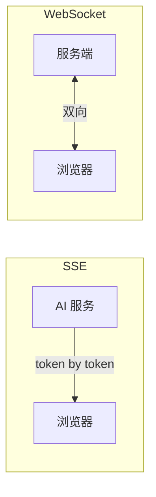
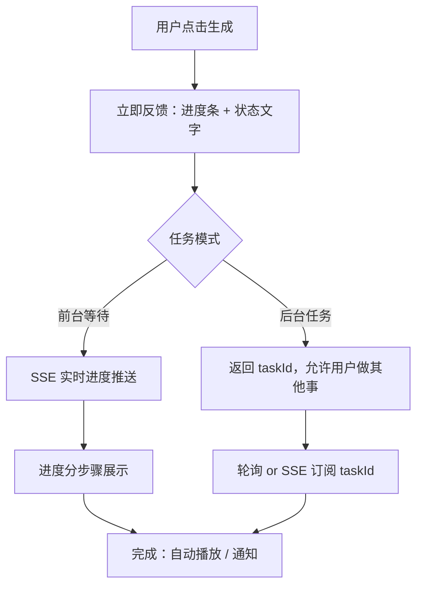

# SSE 与实时通信：AI 流式输出方案

> 百度前端 Agent 面试考点（Q13–Q15）。考察 SSE vs WebSocket 选型判断，以及 SSE 自定义事件的实际应用。

## 1. SSE vs WebSocket 选型

### AI 流式输出为什么选 SSE（Q13）

| 维度 | SSE | WebSocket |
|------|-----|-----------|
| 通信方向 | **单向**（Server → Client） | 双向 |
| 协议 | 普通 HTTP/HTTPS | 需要 Upgrade 握手（ws://） |
| 浏览器支持 | 原生 `EventSource` API | 原生 WebSocket API |
| 自动重连 | **内置**（浏览器自动处理） | 需要手动实现 |
| CDN / 代理兼容 | **✅ 兼容**（标准 HTTP） | ❌ 很多代理不支持 |
| 服务端实现复杂度 | **低**（HTTP 长连接 + `text/event-stream`） | 高（需要 WS 服务器） |
| 适用场景 | 服务端推送、流式输出 | 聊天室、实时协作 |

**核心理由**：AI 流式输出是**单向推送**（服务端 → 浏览器），不需要双向通信。SSE 实现更简单、兼容性更好，且自带重连机制。



### SSE 协议格式

```
HTTP/1.1 200 OK
Content-Type: text/event-stream
Cache-Control: no-cache
Connection: keep-alive

data: {"token": "Hello"}\n\n
data: {"token": " World"}\n\n
event: done\ndata: {}\n\n
```

---

## 2. 前端 SSE 实现（打字机效果）

```typescript
// Angular Service 示例（贴近实际背景）
@Injectable({ providedIn: 'root' })
export class AiStreamService {
  streamChat(prompt: string): Observable<string> {
    return new Observable(observer => {
      const eventSource = new EventSource(
        `/api/chat/stream?q=${encodeURIComponent(prompt)}`
      );

      eventSource.onmessage = (event) => {
        try {
          const data = JSON.parse(event.data);
          if (data.done) {
            observer.complete();
            eventSource.close();
          } else {
            observer.next(data.token);
          }
        } catch (e) {
          observer.error(e);
        }
      };

      eventSource.onerror = (err) => {
        observer.error(err);
        eventSource.close();
      };

      // 取消订阅时关闭连接
      return () => eventSource.close();
    });
  }
}
```

---

## 3. SSE 自定义事件实现进度条（Q15）

**场景**：AI 生成歌曲耗时久，需要实时展示生成进度。

### 服务端（Node.js 示例）

```typescript
app.get('/api/generate/stream', (req, res) => {
  res.writeHead(200, {
    'Content-Type': 'text/event-stream',
    'Cache-Control': 'no-cache',
    'Connection': 'keep-alive',
  });

  // 自定义事件：进度更新
  const sendProgress = (step: string, percent: number) => {
    res.write(`event: progress\n`);
    res.write(`data: ${JSON.stringify({ step, percent })}\n\n`);
  };

  // 自定义事件：任务完成
  const sendComplete = (url: string) => {
    res.write(`event: complete\n`);
    res.write(`data: ${JSON.stringify({ audioUrl: url })}\n\n`);
  };

  // 模拟生成流程
  (async () => {
    sendProgress('analyzing_lyrics', 10);
    await generateLyrics();
    
    sendProgress('composing_melody', 40);
    await composeMelody();
    
    sendProgress('rendering_audio', 70);
    const audioUrl = await renderAudio();
    
    sendProgress('post_processing', 95);
    await postProcess();
    
    sendComplete(audioUrl);
    res.end();
  })();
});
```

### 前端监听自定义事件

```typescript
const eventSource = new EventSource('/api/generate/stream');

// 监听自定义 progress 事件
eventSource.addEventListener('progress', (event: MessageEvent) => {
  const { step, percent } = JSON.parse(event.data);
  updateProgressBar(percent);
  updateStatusText(step);
});

// 监听自定义 complete 事件
eventSource.addEventListener('complete', (event: MessageEvent) => {
  const { audioUrl } = JSON.parse(event.data);
  playAudio(audioUrl);
  eventSource.close();
});

eventSource.onerror = () => {
  showError('生成失败，请重试');
  eventSource.close();
};
```

### 进度条 UI 对应关系（可视化设计加分）

```
分析歌词... ████░░░░░░░░  10%
编曲创作... ████████░░░░  40%
音频渲染... ████████████░ 70%
后期处理... █████████████ 95%
✅ 完成！   ██████████████ 100%
```

---

## 4. 长时间 AI 生成任务的 UX 优化（Q14）

**问题**：AI 生成歌曲可能需要 30–60 秒，用户体验差。

### 优化策略



**具体措施**：

| 方案 | 实现 | 效果 |
|------|------|------|
| 分阶段进度文字 | SSE 自定义事件 | 让用户知道"在干什么" |
| 骨架屏/Loading动画 | CSS animation | 感知等待有意义 |
| 乐观 UI | 先展示上次结果 | 减少空白感 |
| 后台任务 + 通知 | taskId + Web Notification | 允许用户去做别的 |
| 时间预估 | 后端返回 estimatedTime | 明确等待预期 |
| 取消按钮 | AbortController | 给用户控制感 |

---

## 面试 Q&A 速查（百度原题）

**Q: AI 流式输出为什么选 SSE 不选 WebSocket？**  
A: AI 输出是单向推送，不需要双向通信。SSE 基于标准 HTTP 协议，兼容 CDN 和代理，浏览器内置 EventSource 自动重连，服务端实现简单。WebSocket 需要 Upgrade 握手，很多代理不支持，适合聊天室等真双向场景。

**Q: 歌曲生成进度条如何实现？**  
A: 服务端用 SSE 自定义事件（`event: progress`）逐阶段推送进度数据，前端用 `EventSource.addEventListener('progress', handler)` 监听并更新进度条。任务完成时发送 `event: complete` 携带结果 URL。

**Q: 如何优化 AI 生成任务的等待体验？**  
A: 分阶段 SSE 进度文字让用户知道在做什么；提供后台任务模式（返回 taskId + Web Notification）允许用户离开；加时间预估；提供取消按钮给用户控制感。
