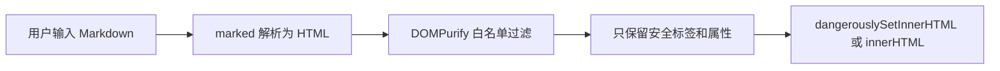
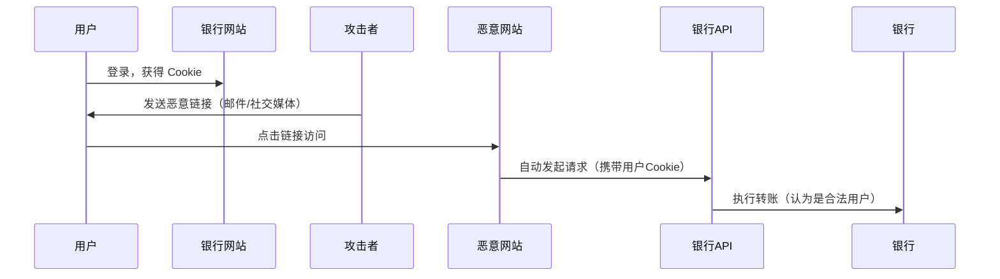

# 前端安全：XSS 防护与 CSRF 攻击

> 百度前端 Agent 面试考点（Q11–Q12）。XSS 考察 Markdown 渲染场景的实际防护，CSRF 考察基础攻防知识。

## 1. Markdown 渲染 XSS 防护

### 攻击场景

用户在 Markdown 编辑器输入恶意内容：

```markdown
[点击](javascript:alert(document.cookie))


<script>alert(1)</script>
```

直接渲染会执行 XSS。

### 防护方案：GFM 白名单（面试中的答法）

**技术栈**：`marked`（Markdown 解析）+ `DOMPurify`（HTML 净化）

```typescript
import { marked } from 'marked';
import DOMPurify from 'dompurify';

function renderMarkdown(input: string): string {
  // Step 1: Markdown → HTML
  const rawHtml = marked.parse(input) as string;
  
  // Step 2: 白名单净化（GFM 常见标签）
  const cleanHtml = DOMPurify.sanitize(rawHtml, {
    ALLOWED_TAGS: [
      'h1', 'h2', 'h3', 'h4', 'h5', 'h6',
      'p', 'br', 'hr',
      'strong', 'em', 'del', 'code', 'pre',
      'ul', 'ol', 'li',
      'blockquote',
      'a', 'img',
      'table', 'thead', 'tbody', 'tr', 'th', 'td',
    ],
    ALLOWED_ATTR: ['href', 'src', 'alt', 'title', 'class'],
    // 禁止 javascript: 协议
    FORBID_ATTR: ['onerror', 'onclick', 'onload'],
    // 仅允许 http/https 链接
    ALLOWED_URI_REGEXP: /^(?:(?:https?|mailto):|[^a-z]|[a-z+.-]+(?:[^a-z+.-:]|$))/i,
  });
  
  return cleanHtml;
}
```

**防护链路**：



### 额外防线

- **CSP（Content Security Policy）**：HTTP 响应头禁止 inline script 执行
  ```
  Content-Security-Policy: default-src 'self'; script-src 'self'
  ```
- **`target="_blank"` 安全属性**：防止 opener 攻击
  ```html
  <a href="..." target="_blank" rel="noopener noreferrer">
  ```
- **iframe 沙箱**：如果需要渲染用户 HTML，用 sandboxed iframe 隔离

---

## 2. CSRF（跨站请求伪造）

### 攻击原理



**关键**：浏览器发请求时会自动携带目标域名的 Cookie，攻击者利用这一机制伪造用户行为。

### 常见攻击形式

```html
<!-- 图片标签触发 GET 请求 -->


<!-- 表单自动提交触发 POST -->
<form action="https://bank.com/transfer" method="POST">
  <input name="amount" value="1000">
  <input name="to" value="attacker">
</form>
<script>document.forms[0].submit()</script>
```

### 防御方案

#### 方案一：CSRF Token（主流方案）

```typescript
// 服务端生成随机 token 存入 Session
const csrfToken = crypto.randomUUID();
session.csrfToken = csrfToken;

// 前端发请求时带上 token（Header 或 body 均可）
fetch('/api/transfer', {
  method: 'POST',
  headers: {
    'X-CSRF-Token': getCsrfTokenFromMeta(), // 从 meta 标签读取
    'Content-Type': 'application/json',
  },
  body: JSON.stringify({ amount: 100 }),
});

// 服务端验证 token 匹配
if (req.headers['x-csrf-token'] !== session.csrfToken) {
  return res.status(403).json({ error: 'CSRF token mismatch' });
}
```

#### 方案二：SameSite Cookie

```
Set-Cookie: sessionId=xxx; SameSite=Strict; Secure; HttpOnly
```

| SameSite 值 | 效果 |
|------------|------|
| `Strict` | 跨站请求完全不携带 Cookie（最严格，可能影响外链跳转） |
| `Lax` | 仅允许安全 GET 跨站携带（现代浏览器默认值） |
| `None` | 允许所有跨站携带（必须配合 Secure） |

#### 方案三：Referer / Origin 验证

```typescript
// 验证请求来源
const origin = req.headers['origin'] || req.headers['referer'];
if (!origin?.startsWith('https://myapp.com')) {
  return res.status(403).end();
}
```

#### 方案四：双重 Cookie（Double Submit Cookie）

将 CSRF Token 同时写入 Cookie 和请求头，服务端比对两者是否一致。攻击者无法读取 Cookie 所以无法伪造。

### XSS vs CSRF 对比

| | XSS | CSRF |
|--|-----|------|
| 攻击目标 | 在用户浏览器执行恶意脚本 | 利用用户身份发起伪造请求 |
| 攻击入口 | 注入恶意内容到页面 | 诱导用户访问恶意链接 |
| 核心防御 | 输出编码 + CSP + 白名单 | CSRF Token + SameSite Cookie |
| 危害 | 窃取 Cookie/凭证、劫持会话 | 伪造转账、修改密码等操作 |

---

## 面试 Q&A 速查（百度原题）

**Q: Markdown 渲染如何防范 XSS？**  
A: 用 `marked` 解析 Markdown 为 HTML，再用 `DOMPurify` + GFM 白名单（只允许安全标签和属性）净化输出，配合 CSP 响应头加固。

**Q: CSRF 是什么？如何防御？**  
A: 攻击者诱导已登录用户访问恶意页面，自动发起携带 Cookie 的伪造请求。防御：① CSRF Token（服务端生成 + 前端每次请求携带）② SameSite=Strict/Lax Cookie ③ 验证 Origin/Referer 请求头。
