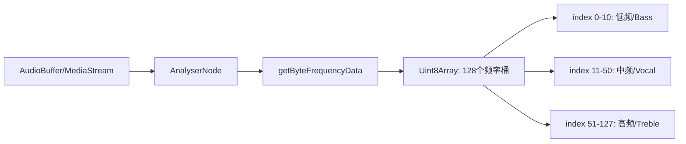

# 打字机效果、音波动画与 Web Audio API

> 百度前端 Agent 面试考点（Q9–Q10，Q17）。考察动画实现原理和 Web Audio API 频谱解析。

## 1. 打字机效果实现（Q9–Q10）

### 实现方案一：requestAnimationFrame（推荐）

```typescript
function typewriterEffect(
  container: HTMLElement,
  text: string,
  targetFps: number = 60
): () => void {
  const intervalMs = 1000 / targetFps; // 60fps ≈ 16.67ms
  let charIndex = 0;
  let lastTime = 0;
  let rafId: number;

  function animate(timestamp: number) {
    if (timestamp - lastTime >= intervalMs) {
      if (charIndex < text.length) {
        container.textContent += text[charIndex];
        charIndex++;
        lastTime = timestamp;
      }
    }

    if (charIndex < text.length) {
      rafId = requestAnimationFrame(animate);
    }
  }

  rafId = requestAnimationFrame(animate);
  
  // 返回取消函数
  return () => cancelAnimationFrame(rafId);
}
```

### 实现方案二：AI 流式输出 + 累积字符

```typescript
// 真实 AI 场景：直接将 SSE token 追加到 DOM
@Component({
  template: `<div #output class="typewriter-output"></div>`
})
export class ChatOutputComponent {
  @ViewChild('output') outputRef!: ElementRef<HTMLDivElement>;
  
  private streamSub?: Subscription;

  startStream(prompt: string) {
    this.streamSub = this.aiStream.streamChat(prompt).subscribe({
      next: (token) => {
        // token 逐个到来，天然实现打字机效果
        this.outputRef.nativeElement.textContent += token;
      },
      complete: () => this.showCursor(false),
    });
  }
}
```

### 帧率数值与计算逻辑（Q10）

**关键数值**：

| 帧率 | 帧间隔 | 场景 |
|------|--------|------|
| 60fps | **16.67ms** | 标准屏，大多数动画 |
| 120fps | 8.33ms | 高刷屏（iPhone Pro/iPad Pro） |
| 30fps | 33.33ms | 视频流畅基线 |

**计算公式**：

$$帧间隔(ms) = \frac{1000}{帧率(fps)}$$

$$60fps = \frac{1000}{60} \approx 16.67ms$$

**requestAnimationFrame 的帧率控制**：

```typescript
function throttleToFps(fps: number) {
  const interval = 1000 / fps;
  let lastTime = 0;
  
  return function(callback: (delta: number) => void) {
    function frame(timestamp: number) {
      const delta = timestamp - lastTime;
      if (delta >= interval) {
        lastTime = timestamp - (delta % interval); // 补偿漂移
        callback(delta);
      }
      requestAnimationFrame(frame);
    }
    requestAnimationFrame(frame);
  };
}
```

**为什么用 rAF 而不是 setInterval**：
- `setInterval` 不与屏幕刷新同步，可能在非渲染帧执行（浪费）
- `rAF` 由浏览器调度，页面不可见时自动暂停（节能）
- `rAF` 的 timestamp 精确到 0.1ms，计算更准

---

## 2. 音波震动效果与 Web Audio API（Q17）

### 面试官补充的核心知识点

> 音频文件可以解析为**携带频谱信息的数组**，用 Web Audio API 的 `AnalyserNode` 实时提取。

### Web Audio API 频谱实现

```typescript
class AudioVisualizer {
  private audioCtx: AudioContext;
  private analyser: AnalyserNode;
  private source: AudioBufferSourceNode | MediaElementAudioSourceNode;
  private dataArray: Uint8Array;
  private rafId: number = 0;
  
  constructor(private canvas: HTMLCanvasElement) {
    this.audioCtx = new AudioContext();
    this.analyser = this.audioCtx.createAnalyser();
    
    // FFT 大小：频率数据精度（必须是2的幂次）
    this.analyser.fftSize = 256; // → 128 个频率桶
    this.dataArray = new Uint8Array(this.analyser.frequencyBinCount);
  }

  connectAudio(audioElement: HTMLAudioElement) {
    const source = this.audioCtx.createMediaElementSource(audioElement);
    source.connect(this.analyser);
    this.analyser.connect(this.audioCtx.destination);
  }

  startVisualize() {
    const ctx = this.canvas.getContext('2d')!;
    const bufferLength = this.analyser.frequencyBinCount;
    const barWidth = this.canvas.width / bufferLength;

    const draw = () => {
      this.rafId = requestAnimationFrame(draw);
      
      // 获取当前帧频谱数据（0-255 的 Uint8Array）
      this.analyser.getByteFrequencyData(this.dataArray);
      
      ctx.clearRect(0, 0, this.canvas.width, this.canvas.height);
      
      for (let i = 0; i < bufferLength; i++) {
        const barHeight = (this.dataArray[i] / 255) * this.canvas.height;
        const x = i * barWidth;
        
        // 根据频率映射颜色（低频红→高频蓝）
        const hue = (i / bufferLength) * 240;
        ctx.fillStyle = `hsl(${hue}, 80%, 50%)`;
        ctx.fillRect(x, this.canvas.height - barHeight, barWidth - 1, barHeight);
      }
    };

    draw();
  }

  stop() {
    cancelAnimationFrame(this.rafId);
  }
}
```

### 频谱数据解读



**实际应用**：
- `dataArray[0..10]`：低频（Bass）→ 驱动大圆圈/主体震动
- `dataArray[11..50]`：中频（人声）→ 驱动中间层
- `dataArray[51+]`：高频 → 驱动细小粒子或边缘效果

### 与用户回答的对比

| | 用户答法 | 面试官补充 |
|--|---------|-----------|
| 方案 | 使用现成音频库 | Web Audio API 原生实现 |
| 数据来源 | 定时解析主频 + 噪声模拟 | `getByteFrequencyData()` 获取完整频谱数组 |
| 精度 | 模拟 | 真实频谱数据（FFT 变换） |
| 库依赖 | 需要第三方库 | 浏览器原生 API |

---

## 3. 动画库 / UI 组件库（Q22）

### 动画库

| 库 | 特点 | 适用场景 |
|----|------|---------|
| **Framer Motion** | React 专属，声明式，手势支持好 | React 页面过渡、交互动画 |
| **GSAP** | 功能最强，时间轴控制，兼容性好 | 复杂序列动画、SVG 动画 |
| **Lottie** | JSON 播放 AE 动画，设计→开发零损耗 | 插图动画、icon 动画 |
| **Motion One** | 轻量，基于 Web Animations API | 简单过渡效果 |
| **Three.js / R3F** | 3D 渲染 | 3D 场景、WebGL 效果 |

### UI 组件库

| 库 | 特点 | 适用场景 |
|----|------|---------|
| **shadcn/ui** | 无样式基础组件，高可定制 | 设计系统定制 |
| **Radix UI** | 无障碍基础原语 | 底层 UI 封装 |
| **MUI** | Google Material Design | 企业管理后台 |
| **Ant Design** | 阿里设计体系，Table/Form 强 | 企业中后台 |
| **Aceternity UI** | 高颜值动效组件 | 美学导向的 Landing Page |

---

## 面试 Q&A 速查（百度原题）

**Q: 打字机效果如何实现？**  
A: `requestAnimationFrame` 控制字符追加频率；AI 流式场景直接利用 SSE token 到来的自然节奏追加 DOM，无需额外 timer。

**Q: 打字机帧率数值和计算逻辑？**  
A: 标准 60fps，每帧间隔 = 1000ms / 60 ≈ 16.67ms。用 rAF 的 timestamp 做差值控制节流，比 setInterval 精确且节能。

**Q: 音波震动效果如何实现？**  
A: 用 Web Audio API 的 `AnalyserNode`，调用 `getByteFrequencyData()` 每帧获取 FFT 频谱数组（128 个桶，值域 0–255），用 rAF + Canvas/SVG 将频谱数组渲染为条形/波形动画。低频驱动大圆、高频驱动细节。
