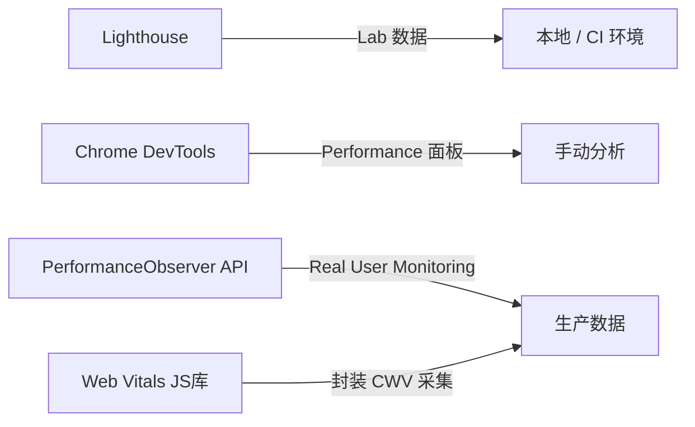
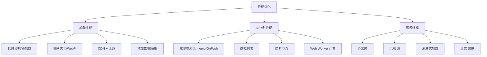

# 前端性能优化与监控指标

> 百度前端 Agent 面试考点（Q19–Q20）。面试官对结合项目深耕性能优化的回答给出加分评价。

## 1. 核心性能指标（Q19）

### Core Web Vitals（Google 核心网页指标）

| 指标 | 全称 | 含义 | 优秀阈值 |
|------|------|------|---------|
| **LCP** | Largest Contentful Paint | 最大内容元素渲染时间 | < 2.5s |
| **FID** | First Input Delay | 首次输入延迟 | < 100ms |
| **CLS** | Cumulative Layout Shift | 累积布局偏移 | < 0.1 |
| **INP** | Interaction to Next Paint | 交互到下帧渲染（FID 继任者） | < 200ms |

### 其他重要指标

| 指标 | 含义 | 工具 |
|------|------|------|
| **FCP** | First Contentful Paint（首次内容绘制） | Lighthouse |
| **TTFB** | Time to First Byte（服务器响应时间） | Network DevTools |
| **TTI** | Time to Interactive（可交互时间） | Lighthouse |
| **TBT** | Total Blocking Time（总阻塞时间） | Lighthouse |
| **Bundle Size** | JS 包体积 | Webpack Bundle Analyzer |

---

## 2. 性能监控手段（Q19）

### 工具层



### PerformanceObserver 代码示例

```typescript
// 采集 LCP
const lcpObserver = new PerformanceObserver((entryList) => {
  const entries = entryList.getEntries();
  const lastEntry = entries[entries.length - 1] as PerformancePaintTiming;
  console.log('LCP:', lastEntry.startTime);
  
  // 上报到监控平台
  reportMetric('LCP', lastEntry.startTime);
});
lcpObserver.observe({ type: 'largest-contentful-paint', buffered: true });

// 采集 CLS
let clsValue = 0;
const clsObserver = new PerformanceObserver((entryList) => {
  for (const entry of entryList.getEntries() as any[]) {
    if (!entry.hadRecentInput) {
      clsValue += entry.value;
    }
  }
  reportMetric('CLS', clsValue);
});
clsObserver.observe({ type: 'layout-shift', buffered: true });

// 采集 FID（已被 INP 替代但仍常考）
const fidObserver = new PerformanceObserver((entryList) => {
  for (const entry of entryList.getEntries() as any[]) {
    reportMetric('FID', entry.processingStart - entry.startTime);
  }
});
fidObserver.observe({ type: 'first-input', buffered: true });
```

### RUM（真实用户监控）方案

```typescript
// 使用 web-vitals 库（Google 官方）
import { onLCP, onFID, onCLS, onINP, onFCP, onTTFB } from 'web-vitals';

function reportToAnalytics(metric: any) {
  // 批量上报，减少请求数
  navigator.sendBeacon('/api/metrics', JSON.stringify({
    name: metric.name,
    value: metric.value,
    rating: metric.rating, // 'good' | 'needs-improvement' | 'poor'
    id: metric.id,
    url: location.href,
    timestamp: Date.now(),
  }));
}

onLCP(reportToAnalytics);
onFID(reportToAnalytics);
onCLS(reportToAnalytics);
onINP(reportToAnalytics);
```

---

## 3. 项目级性能优化方案（Q20，加分项）

> 面试官评价：「很少求职者深耕这块内容」。结合较差服务器条件落地多项优化，更有说服力。

### 加载性能优化

#### 代码分割 / 懒加载（Next.js / Angular）

```typescript
// Next.js 动态导入（代码分割）
const HeavyComponent = dynamic(() => import('./HeavyComponent'), {
  loading: () => <Skeleton />,
  ssr: false, // 高交互组件关闭 SSR
});

// Angular 路由懒加载
const routes: Routes = [
  {
    path: 'dashboard',
    loadComponent: () => import('./dashboard/dashboard.component')
      .then(m => m.DashboardComponent),
  }
];
```

#### 资源优化

```typescript
// Next.js Image 自动优化（WebP + 尺寸响应式）
import Image from 'next/image';
<Image src="/hero.jpg" width={1200} height={600} priority />

// 字体子集化（减少字体文件大小）
// next.config.js
module.exports = {
  optimizeFonts: true,
};
```

#### 预加载关键资源

```html
<!-- 预连接 API 域名 -->
<link rel="preconnect" href="https://api.example.com">

<!-- 预加载首屏关键 JS -->
<link rel="preload" href="/main.chunk.js" as="script">

<!-- 预获取下一页资源 -->
<link rel="prefetch" href="/next-page.chunk.js">
```

### 运行时性能优化

#### React / Angular 渲染优化

```typescript
// React：避免不必要的重渲染
const MemoizedItem = React.memo(({ item }: { item: Item }) => {
  return <div>{item.name}</div>;
});

// Angular：OnPush 变更检测策略
@Component({
  changeDetection: ChangeDetectionStrategy.OnPush,
})
export class ItemListComponent {
  // 仅在 @Input 引用变化时重新渲染
}

// 虚拟列表（大数据量）
import { CdkVirtualScrollViewport } from '@angular/cdk/scrolling';
```

#### 防抖 / 节流

```typescript
// 搜索框防抖（Angular RxJS）
this.searchControl.valueChanges.pipe(
  debounceTime(300),
  distinctUntilChanged(),
  switchMap(query => this.searchService.search(query))
).subscribe(results => this.results = results);
```

### 服务器环境差时的优化策略（面试亮点）

> 背景：服务器资源受限，无法靠扩容解决问题，必须从前端入手。

| 优化手段 | 具体做法 | 效果 |
|---------|---------|------|
| **HTTP/2 + 多路复用** | Nginx 开启 HTTP/2 | 减少连接数，并行加载 |
| **静态资源 CDN** | 将 JS/CSS/图片上 CDN | 降低服务器带宽压力 |
| **Brotli 压缩** | Nginx `brotli on` | 比 gzip 减少 20-30% 体积 |
| **长期缓存** | 文件名含 hash，`Cache-Control: max-age=31536000` | 复访 0 流量 |
| **Service Worker** | 离线缓存关键 shell | 弱网可用 |
| **请求合并** | 批量 API + GraphQL | 减少请求次数 |
| **关键路径 CSS 内联** | 首屏 CSS 内联，异步加载其余 | 减少渲染阻塞 |

### 性能优化全景图



---

## 4. Next.js SSR 选型问题（Q18）

**面试官结论**：高交互场景不适合 SSR，属于选型错误。

| 场景 | 推荐方案 | 原因 |
|------|---------|------|
| 博客/文档/营销页 | SSR / SSG | SEO 友好，内容静态 |
| 管理后台 / SaaS | CSR（纯 React/Angular） | 高交互，不需要 SEO |
| 电商商品页 | SSR + ISR | SEO + 数据时效性 |
| AI 聊天应用 | CSR + 流式 | 大量浏览器 API，实时交互 |

**Angular 背景加分**：Angular 主要做 CSR，天然没有 SSR 复杂度问题，适合高交互的企业级应用。

---

## 面试 Q&A 速查（百度原题）

**Q: 了解哪些前端性能指标？**  
A: Core Web Vitals：LCP（最大内容渲染 < 2.5s）、FID/INP（交互延迟 < 100ms/200ms）、CLS（布局偏移 < 0.1）。还有 FCP、TTFB、TTI。

**Q: 对应的性能监控手段？**  
A: Lab 环境用 Lighthouse / Chrome DevTools；生产用 PerformanceObserver API 或 web-vitals 库采集 RUM 数据，通过 `navigator.sendBeacon` 上报。

**Q: 结合项目讲解性能优化方案？**  
A: 加载层：代码分割 + 懒加载 + 图片 WebP + Brotli 压缩 + CDN + 预加载；运行时：OnPush 变更检测 + 虚拟列表 + RxJS 防抖；服务器差的情况下：HTTP/2 + 长期缓存 + Service Worker 离线化，靠前端把服务器压力降到最低。
